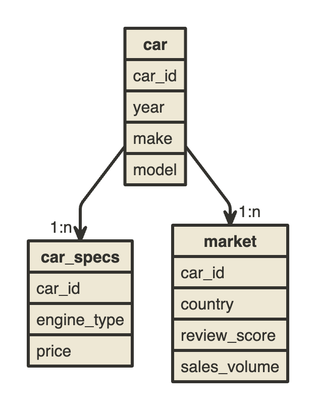

# Hello beev
- ZENINI SALIM
- zenini.salim@gmail.com

# Project
    - ELT: 
        - Extract: 
            From google drive source 
        - Load 
            To local database
        - Transform
            SQL scripts in elt/dbt/models
        - Test
            SQL scipts in elt/dbt/tests
    - init_db
        - initial configuration for the database
            create extract schemas
            configure users and permissions
### Requirements
    DBT:
        https://docs.getdbt.com/docs/core/installation

    pyenv:

        - install:
            https://github.com/pyenv/pyenv#readme
        - create env: 
            pyenv virtualenv 3.8.10 beev_python_env
        - activate_env: 
            pyenv activate beev_python_env
        - install_requirements:
            pip install -r requirements.txt 
        - check_installed_libraries: 
            pip freeze
        - delete_all_libraries: #caution
            pip freeze | xargs pip uninstall -y

    Environement variables
        - source the .env to your shell and python interpreter
### Model

# DBT transformations
    # base models : 
        write the models as they are extracted, with only renaling
    # modelisation :
        - Data modelisation based (and limited) on the extracted data logic
        - The logic is then persisted by dbt tests to unshure it'll stay the same 
          throughout the analysis
    # analysis :
        - Answer to the questions 

# Get started 
    Execute the command -> make execute_order_66 
    in the root directory
    it will : 
        - Restart the docker container 
            this will delete all the data. i chose not to
            alocate a volume to persist the data as it has 
            utility.
        - Extract the data from the Google drive
        - Run DBT 
        - run DBT tests
    You will find the tables in the schema "analysis"

    Q1: sales_volume_by_model_by_country.sql
    Q2: max_sales_volume_by_country.sql
    Q3: model_sold_in_usa_but_not_in_france.sql
    Q4: average_car_cost_by_engine_type.sql
    Q5: average_rating_by_engine_type.sql
    Bonus : sales_by_engine_type.sql
